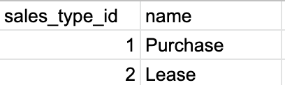

# Exploring the Data in Google Sheets

The data provided for us for Carnival currently exists in the form of CSVs for Comma Separated Values files. First let's take a look at all the CSV screenshots below and how the data is currently organized.

### Sales table

### SalesTypes table

### Vehicles table

### VehicleTypes table

### Customers table

### Dealerships table

### Employees table

### EmployeesTypes table

### DealershipEmployees table

### RepairTypes table

  

Each CSV contains one kind of data that is being tracked by the dealerships on the Carnival platform.

As we progress through this first book, we want to build a relational database for Carnival. And the first step in that process will be to design the database. To start discussing the design of our database, there are some key terms that we will be using:  

## The structure of a Relational Database

As you can see from our data, it is very common to organize the data into rows and columns. This holds true for a relational databases as well. A **table** in the database will be made up of rows and columns. Each **row** in a database table is an instance of the type of object described in that table. The **columns** in a table are the attributes that describe that type of object. When there are multiple tables that are related to each other, that’s a relational database.

In a table, a key is what identifies each unique record or row:

### Primary Keys

A primary key (PK) is a single column that can be used to uniquely identify each record in the table. It can not be null and any new record added to the table must have a unique value as the PK.

### Foreign Keys

A foreign key (FK) refers to the PK of a foreign table. It is usually used to establish a relationship between tables. FKs can be null and they do not have to be unique.

Explore the data on each of the CSVs for Carnival and be prepared to discuss the different types of data, and write down any questions you have about the data. For each dataset, what is the primary key? Are there any foreign keys? In the next class, your instructor will answer questions and provide an overview of the structure of the data.

## Resources 

1. [RDBMS Concepts](https://www.studytonight.com/dbms/rdbms-concept.php)
1. [Primary Keys](https://www.youtube.com/watch?v=E3Bs3H14C8Y)
1. [Foreign Keys](https://www.youtube.com/watch?v=5HQzigiRb5c)
1. [Database Key Terms](https://www.kdnuggets.com/2016/07/database-key-terms-explained.html)
